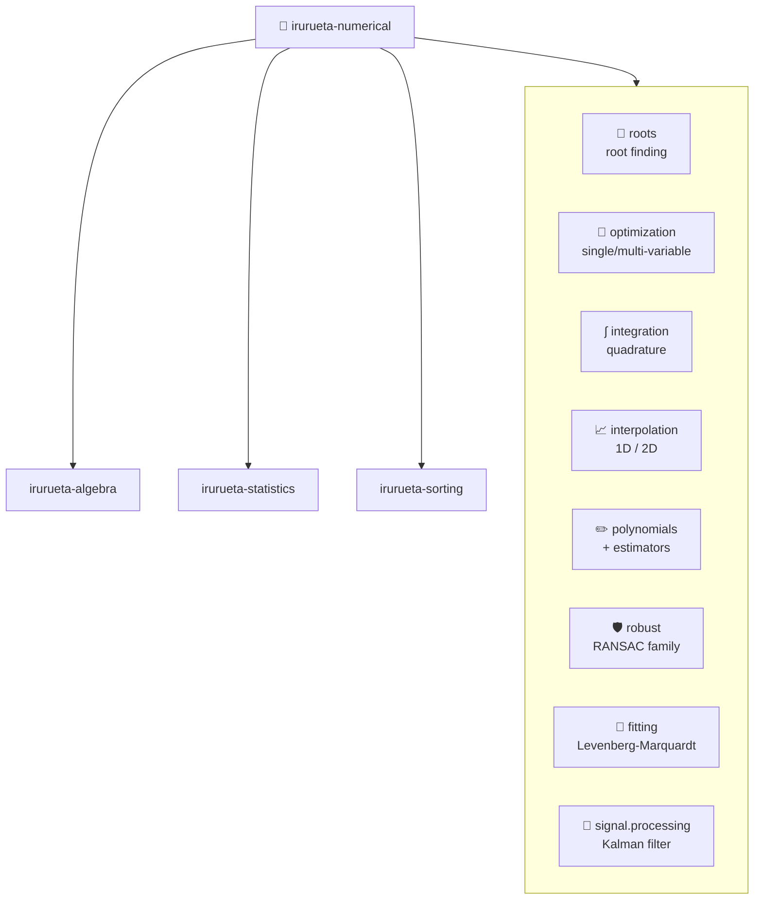
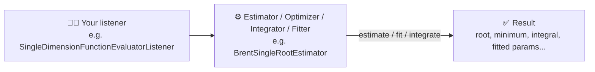

# 🔢 irurueta-numerical

Numerical utilities

[](https://github.com/albertoirurueta/irurueta-numerical/actions/workflows/master.yml)
[](https://github.com/albertoirurueta/irurueta-numerical/actions/workflows/develop.yml)
[](https://search.maven.org/artifact/com.irurueta/irurueta-numerical)

[](https://sonarcloud.io/dashboard?id=albertoirurueta_irurueta-numerical)
[](https://sonarcloud.io/dashboard?id=albertoirurueta_irurueta-numerical)
[](https://sonarcloud.io/dashboard?id=albertoirurueta_irurueta-numerical)

[](https://sonarcloud.io/dashboard?id=albertoirurueta_irurueta-numerical)
[](https://sonarcloud.io/dashboard?id=albertoirurueta_irurueta-numerical)

[](https://sonarcloud.io/dashboard?id=albertoirurueta_irurueta-numerical)
[](https://sonarcloud.io/dashboard?id=albertoirurueta_irurueta-numerical)
[](https://sonarcloud.io/dashboard?id=albertoirurueta_irurueta-numerical)

[](https://sonarcloud.io/dashboard?id=albertoirurueta_irurueta-numerical)
[](https://sonarcloud.io/dashboard?id=albertoirurueta_irurueta-numerical)
[](https://sonarcloud.io/dashboard?id=albertoirurueta_irurueta-numerical)

## 📊 Project Status

| | |
| --- | --- |
| Language | Java 17 |
| Build tool | Maven |
| Current development version | `1.6.0-SNAPSHOT` |
| Latest release | `1.5.0` |
| License | [Apache License 2.0](LICENSE.txt) |
| CI | GitHub Actions — build and test on every push to `develop`, and again when a release is published from `master` |
| Quality | SonarCloud, JaCoCo coverage, Checkstyle, SpotBugs, PMD |

## 📚 Documentation

* [Antora documentation site](https://albertoirurueta.github.io/irurueta-numerical/)
* [Maven site report](https://albertoirurueta.github.io/irurueta-numerical/mvn-site/) (Javadoc, test results, coverage, static analysis)
* [SonarCloud dashboard](https://sonarcloud.io/dashboard?id=albertoirurueta_irurueta-numerical)
* [Changelog](CHANGELOG.md)

## 📦 Installation

Add the following dependency to your project:

Latest release:
```xml
<dependency>
    <groupId>com.irurueta</groupId>
    <artifactId>irurueta-numerical</artifactId>
    <version>1.5.0</version>
    <scope>compile</scope>
</dependency>
```

Latest snapshot:
```xml
<dependency>
    <groupId>com.irurueta</groupId>
    <artifactId>irurueta-numerical</artifactId>
    <version>1.6.0-SNAPSHOT</version>
    <scope>compile</scope>
</dependency>
```

## 🧩 Architecture

`irurueta-numerical` builds on top of three sibling `com.irurueta` libraries, and organizes its own algorithms into
focused packages grouped by numerical domain:



## ⚙️ How It Works

Algorithms in this library are driven by a listener instance rather than a generic functional interface — for
example, a `SingleDimensionFunctionEvaluatorListener` evaluates `f(x)` at a given point (its single lambda-compatible
method makes it just as easy to pass a lambda as a full class). This keeps every root finder, optimizer,
integrator, and fitter in the library behind the same small set of conventions, so one implementation (e.g.
Brent's method) can be swapped for another (e.g. Newton-Raphson) without changing how the surrounding code is
wired:



For example, finding the root of `f(x) = x^2 - 2` inside `[0, 2]` using Brent's method:

```java
SingleDimensionFunctionEvaluatorListener listener = x -> x * x - 2.0;

var estimator = new BrentSingleRootEstimator(listener, 0.0, 2.0, 1e-9);
estimator.estimate();

double root = estimator.getRoot(); // ~1.4142135623730951
```

Every other estimator/fitter in the library (roots, optimization, integration, interpolation, polynomial fitting,
robust RANSAC-family estimation, Levenberg-Marquardt curve fitting, Kalman filtering) follows this same
listener-in / result-out shape. See the [Antora documentation site](https://albertoirurueta.github.io/irurueta-numerical/)
for an overview of each package.

## 📄 License

This project is licensed under the [Apache License 2.0](LICENSE.txt).
